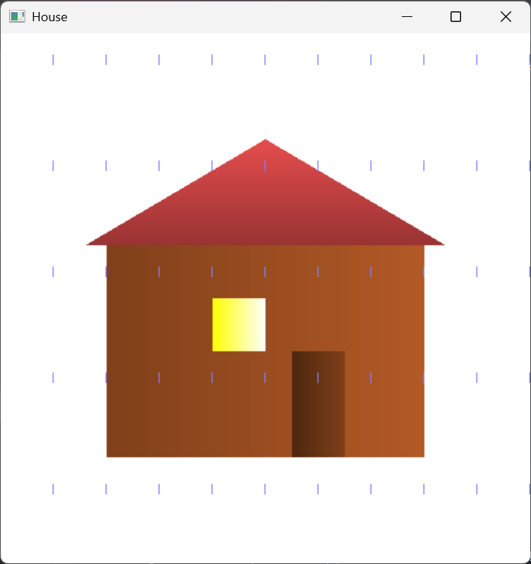
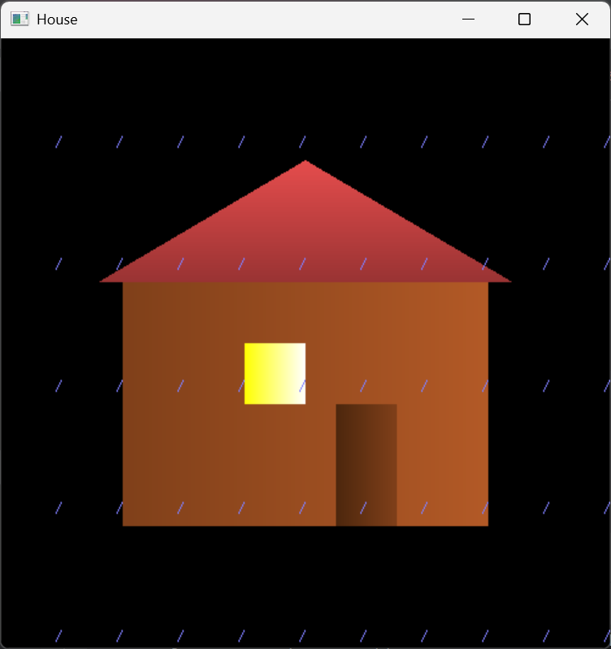

# 🏠 House with Rain Animation (OpenGL)

This is a simple OpenGL Python project that draws a house and simulates rainfall. It also supports dynamic day and night transitions and wind direction using keyboard input.

---

## 🌦️ Features

- 🏠 2D House drawn with OpenGL
- 🌧️ Rainfall effect using animated lines
- 🌗 Dynamic background (day → night)
- 💨 Wind direction (left or right bend in rain)


---

## 🕹️ Controls

| Key / Action        | Effect                             |
|---------------------|------------------------------------|
| `d`                 | Increase brightness (day mode)     |
| `n`                 | Decrease brightness (night mode)   |
| Left Arrow          | Wind blows left (rain bends left)  |
| Right Arrow         | Wind blows right (rain bends right)|

---
## House Preview

### Day View


### Night View


---
## 🖥️ How to Run

1. **Install required libraries**:
   ```bash
   pip install PyOpenGL PyOpenGL_accelerate
